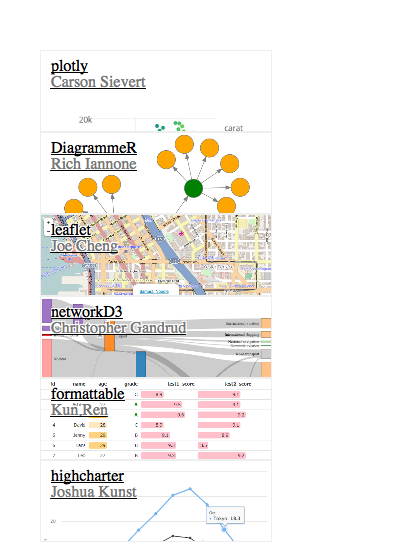

<!-- README.md is generated from README.Rmd. Please edit that file -->

[](https://cran.r-project.org/package=gallerywidget)
[](https://www.tidyverse.org/lifecycle/#maturing)
[](https://travis-ci.org/ijlyttle/gallerywidget)

# gallerywidget

The goal of gallerywidget is to provide you with the means to create a
gallery of images, each of which contains a hyperlink, and may contain a
title and a subtitle. The inspiration for this gallery tool is taken
from Mike Bostock’s [blocks website](https://bl.ocks.org), as well as
the [Vega-Lite website](https://vega.github.io/vega-lite).

## Installation

This package is not yet on CRAN; but you can install it from GitHub:

``` r
#install.packages("devtools")
devtools::install_packages("ijlyttle/gallerywidget")
```

## Example

``` r
library("gallerywidget")
library("tibble")
```

This package contains a single function, `gallerywidget()`, and a single
sample-dataset, `data_htmlwidgets`.

The `data_htmlwidgets` dataset was built using examples from the
[htmlwidgets gallery](http://gallery.htmlwidgets.org):

``` r
glimpse(data_htmlwidgets)
#> Observations: 6
#> Variables: 4
#> $ href     <chr> "https://plot.ly/r", "https://rich-iannone.github.io/...
#> $ image    <chr> "http://gallery.htmlwidgets.org/images/ropensci-plotl...
#> $ title    <chr> "plotly", "DiagrammeR", "leaflet", "networkD3", "form...
#> $ subtitle <chr> "Carson Sievert", "Rich Iannone", "Joe Cheng", "Chris...
```

Each row of the dataset is associated with an example in the gallery;
the dataset has four columns:

  - `href` URL destination of link
  - `image` URL for the preview image
  - `title` character string for the title
  - `subtitle` character string for the subtitle

The `gallerywidget()` function is used to render the widget:

``` r
gallerywidget(data_htmlwidgets)
```



## Acknowledgements

As mentioned above, this work is inspired by the galleries for from Mike
Bostock’s [blocks website](https://bl.ocks.org), as well as the
[Vega-Lite website](https://vega.github.io/vega-lite). The css is a mix
of the css from both of these sites - I trust that it is cool with all
involved that their code is repurposed in this fashion.
